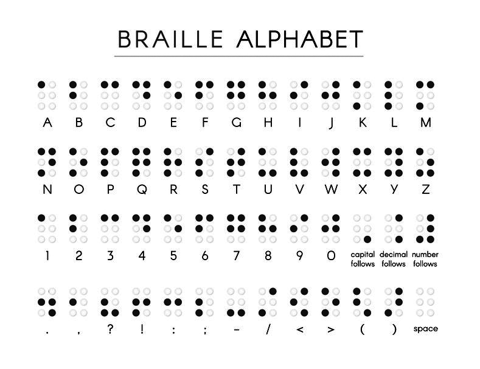

---

## Braille Translator
This is an application that can translate Braille to English and vice versa. 

The string to translate will be passed into the application as an argument at runtime. The application is smart enough to determine if the string given to it is either Braille or English and automatically convert it to the appropriate opposite. 

For simplicity, Braille is displayed as `O` and `.` where `O` represents a raised dot. It includes the entire English alphabet, the ability to `capitalize` letters, add `spaces`, and the numbers `0` through `9` as well. 

After conversion, the output to the terminal is the translated string--and nothing else. 

## What is Braille?
Braille (*/breɪl/ **BRAYL***) is a tactile writing system used by people who are visually impaired. Braille characters are formed using a combination of six raised dots arranged in a 3 × 2 matrix, called the braille cell. The number and arrangement of these dots distinguishes one character from another. ([via Wikipedia](https://en.wikipedia.org/wiki/Braille))

  

  <em style='font-size:xx-small;'>Black dots represent raised areas</em>

## How It Works
- Translator
  - Given arguments passed into the program at runtime, the application determines if the given string should be translated to English or Braille.
  - For Braille, each character is stored as a series of `O` (the letter O) or `.` (a period).
  - Braille symbols are stored as a 6 character string reading left to right, line by line, starting at the top left. See examples below.
  - When a Braille `capital follows` symbol is read, the application assumes only the next symbol should be capitalized. 
  - When a Braille `number follows` symbol is read, the application assumes all following symbols are numbers until the next `space` symbol.
- Braille Alphabet
  - Letters `a` through `z`
    - The ability to capitalize letters
  - Numbers `0` through `9`
  - The ability to include `spaces` ie: multiple words

## Examples
- Launching your application with English or Braille:
  - `node translator.js Hello world`
  - `node translator.js .....OO.OO..O..O..O.O.O.O.O.O.O..OO........OOO.OO..OO.O.OOO.O.O.O.OO.O..`
---
- Input: `Hello world`
- Output: `.....OO.OO..O..O..O.O.O.O.O.O.O..OO........OOO.OO..OO.O.OOO.O.O.O.OO.O..`
---
- Input: `42`
- Output: `.O.OOOOO.O..O.O...`
---
- Input: `.....OO.....O.O...OO...........O.OOOO.....O.O...OO....`
- Output: `Abc 123`
